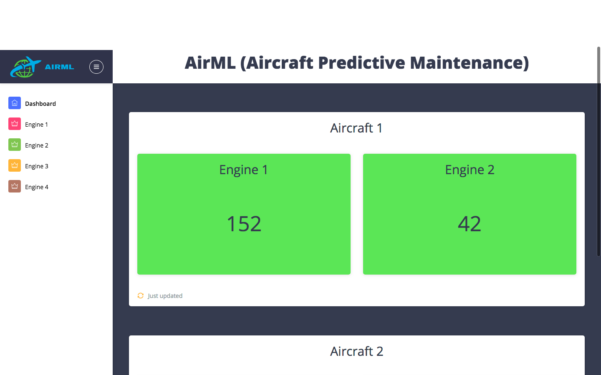
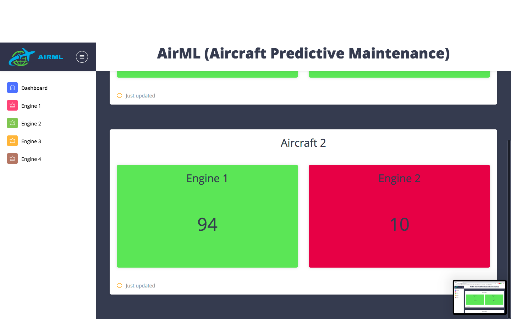
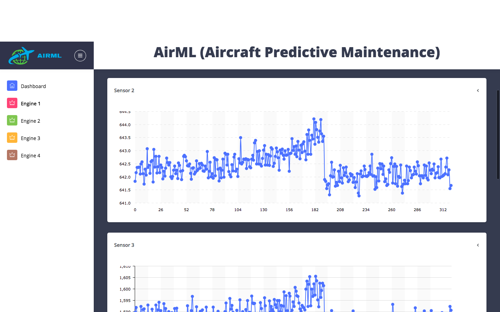
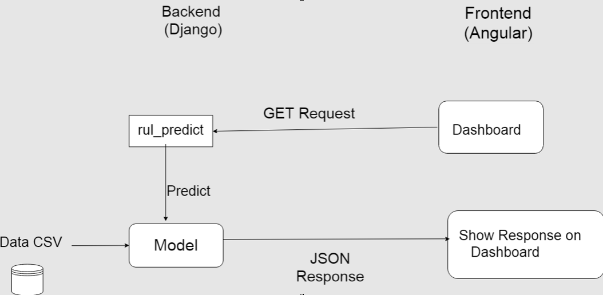

# AirML

## Using machine learning to predict the aircraft life and other parameters.

The project is divided into 3 parts. 

### 1. Training 

  The dataset used here is the [Turbofan engine degradation simulation dataset](https://ti.arc.nasa.gov/dev/tech/dash/groups/pcoe/prognostic-data-repository/#turbofan) by NASA.
  
  It contains data from 249 engines with 21 sensor readings and 3 operational settings.

  #### A look at the raw data:
  
  
  After data cleaning, labeling and feature engineering the data is used to feed into Machine Learning algorithms.
    
  #### The cleaned data:
  
  
  The algorithms Random Forest, XGBoost and Neural Network were tested and the best one to perform was Random Forest for predictions.

### 2. Frontend

  The frontend was built using Angular 4.
  
  First install the dependencies using `npm install` and then run the angular server use the following command 

  `ng serve`.
  

  
  

  
  

  

### 3. Backend

The backend is built using Django.
  
Install the dependencies using 

`pip install -r requirements.txt` 

and then run the server using 

`python manage.py runserver`.

Now, goto `http://localhost:4200` to see the application running.

You can see the working of the application below

### To download the models and data directories contact me at adeshg7@gmail.com
